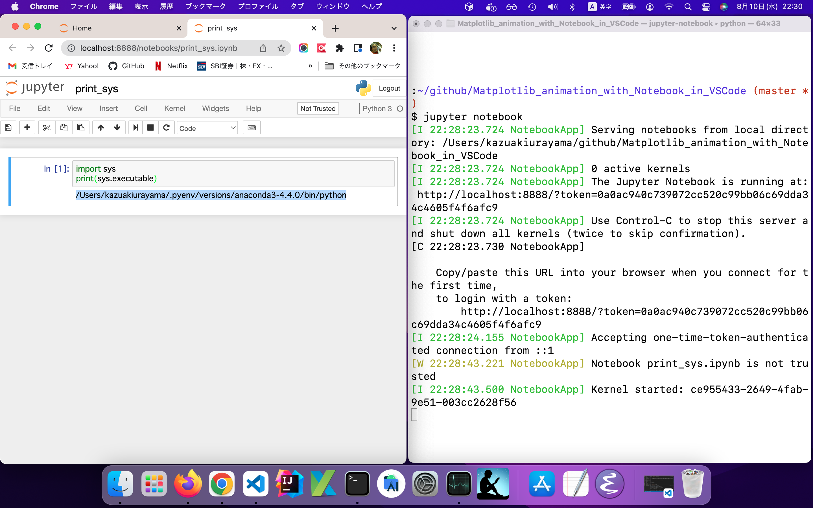
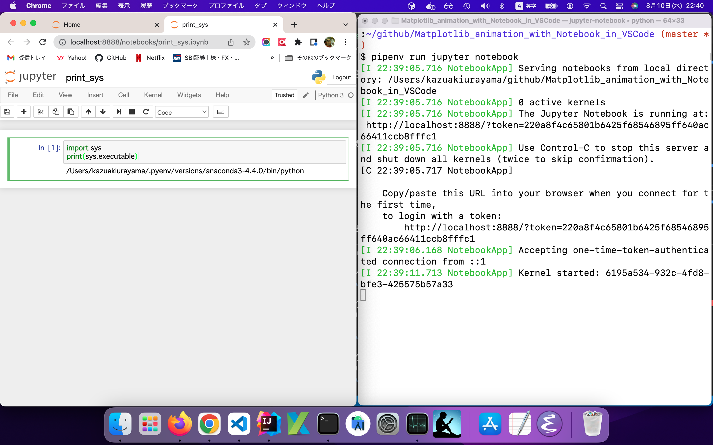
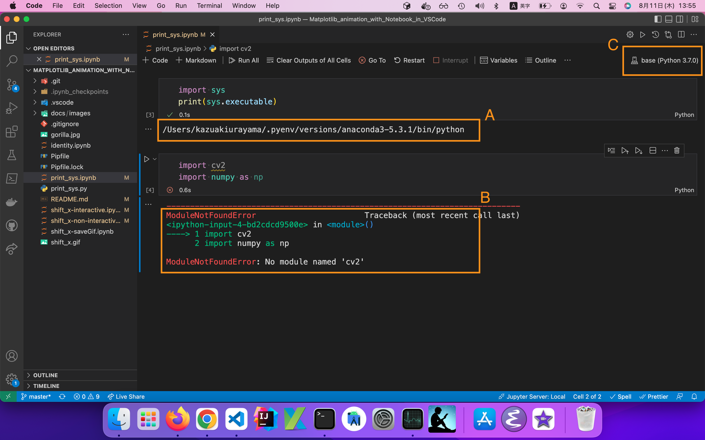
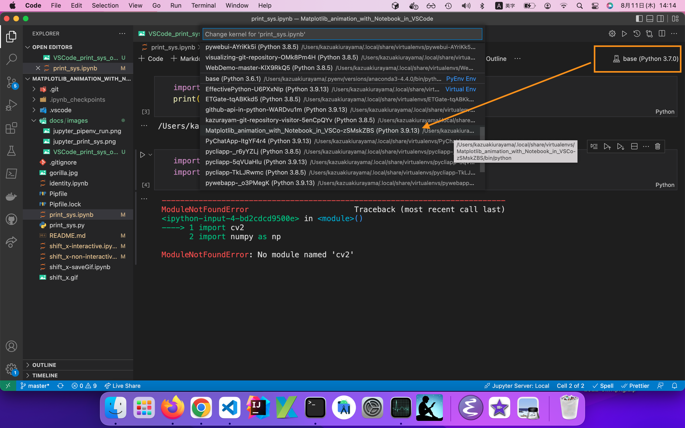
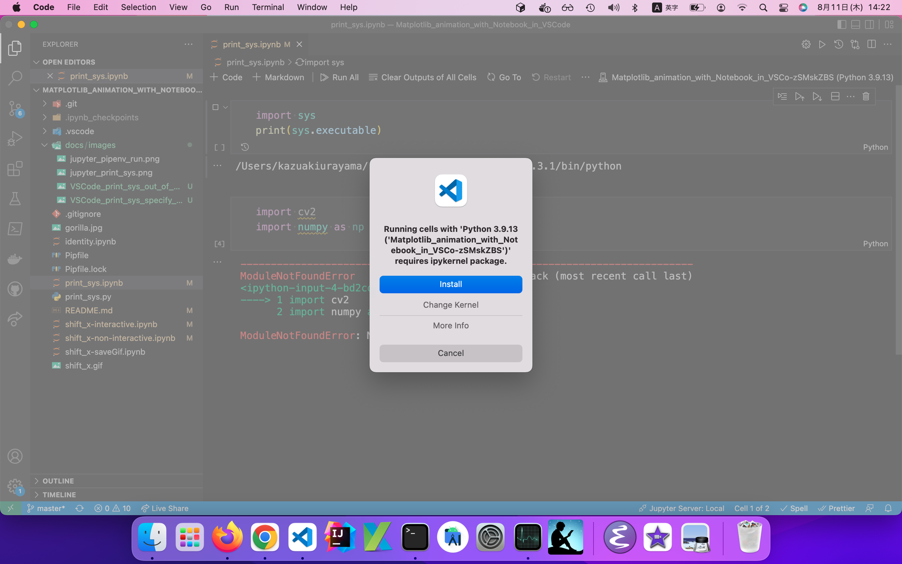
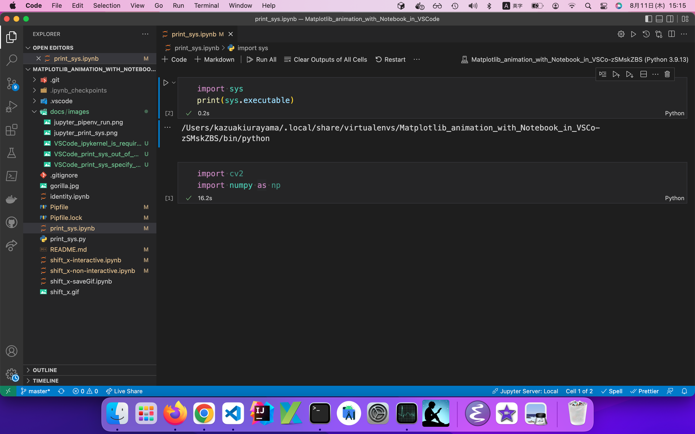
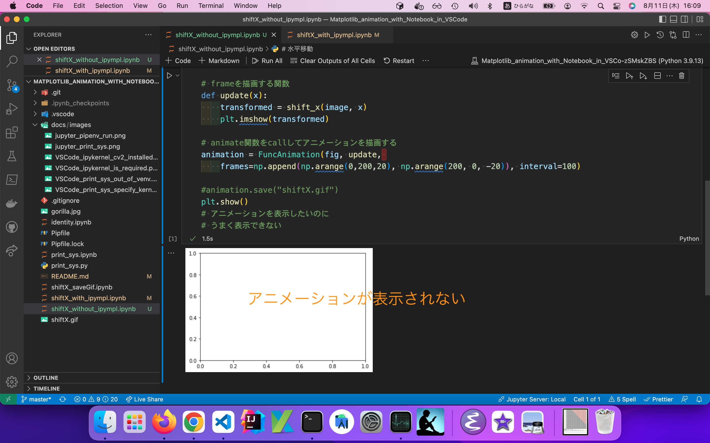
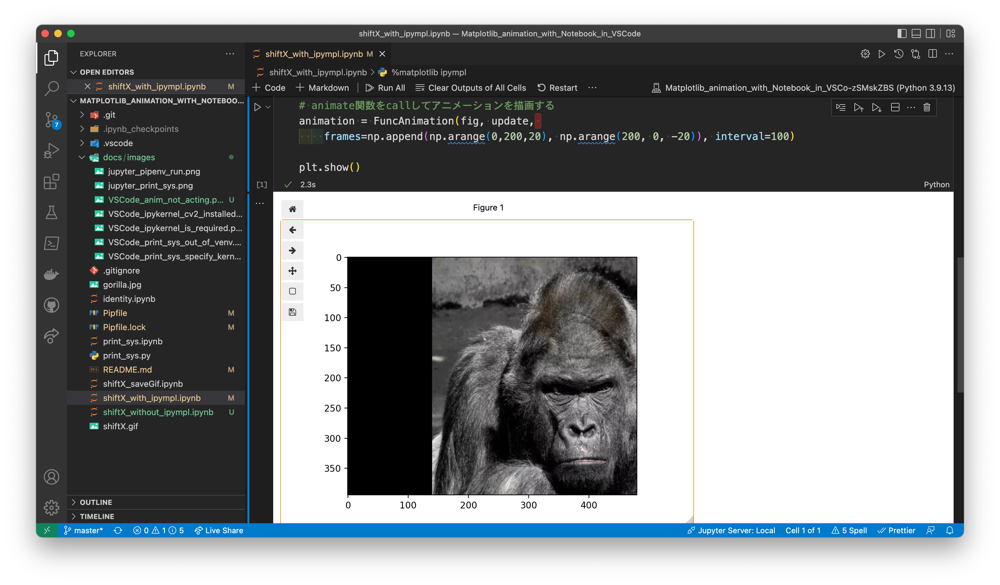

# VSCodeのなかNotebookのなかでMatplotlibアニメーションを動かしてみた

## 解決したい問題

[「ゼロから作るDeep Learning」斎藤康毅著 O'Reilly刊](https://www.oreilly.co.jp/books/9784873117584/)の「5.6 Affine/Softmaxレイヤの実装」を読んでいて引っかかった。「Affine変換って何だっけ？」　Qiitaで *アフィン変換* を検索したら下記の記事を見つけた。

- [完全に理解するアフィン変換 @koshain2](https://qiita.com/koshian2/items/c133e2e10c261b8646bf)

とてもためになりそうな記事だが、Affine変換の学習を始める前に僕の関心は脇道に逸れてしまった。というのも、この記事に次のようなアニメーションが貼ってあったから。

 

このアニメーションをどうやって作るのか、作り方を知りたい！と思った。記事にPythonコードが掲載されていたからそれを写経しさえすればすぐ作れそうだった。ただしわたしは自分好みのPython環境でアニメーションを動かしたいと思った。すなわち

1. IDEとして[Visual Studio Code](https://code.visualstudio.com/)を使いたい。もちろん[Python for VSCode](https://code.visualstudio.com/docs/languages/python)を入れて。
2. VSCodeの中で [Notebook](https://code.visualstudio.com/docs/datascience/jupyter-notebooks) すなわちファイル名が `*.ipynb` であるファイルをエディタで作って実行したい。
3. Notebookをエディタで開き、pythonコードを選んで Ctrl+Enter で run する。するとJupyter Server:Localがpythonコードを実行して、その結果としてアニメーションがNotebookの中で動く。こういう操作をしたい。
4. ただし作業プロジェクトのために固有のpython仮想環境を作って使いたい。 [pipenv](https://pypi.org/project/pipenv/) で。具体例を挙げるならば `"$ pipenv install opencv-python"` でインストールした [`cv2`](https://pypi.org/project/opencv-python/) ライブラリを VSCodeの中のNotebookの中のpythonコードがimportできるようにしたい。そのためにはpipenvで作った仮想環境の中のPythonインタプレタを使ってVSCodeのなかNotebookのなかのpythonコードを実行することが必要である。

試行錯誤したあげく望ましい実行環境を構築することができた。どのように環境を作ったか、ここに自分のためにメモします。

わたしが使っているOSはmacOS v12.3です。

## 準備1 pipenv

何はともあれmacOSにPython3をインストールした。具体的な手順は[こちら](https://github.com/kazurayam/MyPythonProjectTemplate#python%E5%87%A6%E7%90%86%E7%B3%BB%E3%82%92macos%E3%81%AB%E3%82%A4%E3%83%B3%E3%82%B9%E3%83%88%E3%83%BC%E3%83%AB%E3%81%99%E3%82%8B)を参照のこと。

pipenvをインストールした。Python仮想環境を作れるように。具体的な手順は[こちら](https://github.com/kazurayam/MyPythonProjectTemplate#pycliapp%E3%82%B5%E3%83%96%E3%83%97%E3%83%AD%E3%82%B8%E3%82%A7%E3%82%AF%E3%83%88%E3%81%AE%E3%81%9F%E3%82%81%E3%81%ABpython%E4%BB%AE%E6%83%B3%E7%92%B0%E5%A2%83%E3%82%92%E4%BD%9C%E3%82%8B-----pipenv)を参照のこと。

## 準備2 本プロジェクトのためにディレクトリと仮想環境を作った

```
$ mkdir ~/Matplotlib_animation_with_Notebook_in_VSCode
$ cd ~/Matplotlib_animation_with_Notebook_in_VSCode
$ export PRJDIR=$(pwd)
```

以下でプロジェクトのディレクトリを示す必要がある場合、文を短くするため`$PRJDIR`と記すことにする。

本プロジェクトのためにPython仮想環境を作った。

```
$ cd $PRJDIR
$ pipenv --python 3
Creating a virtualenv for this project...
Pipfile: /Users/kazurayam/github/Matplotlib_animation_with_Notebook_in_VSCode/Pipfile
Using /usr/local/bin/python3.9 (3.9.13) to create virtualenv...
⠋ Creating virtual environment...

✔ Successfully created virtual environment!
Virtualenv location: /Users/kazurayam/.local/share/virtualenvs/Matplotlib_animation_with_Notebook_in_VSCo-zSMskZBS
```

上記コマンドによってPython仮想環境が作られるが、それがどのパスにあるかを調べるには次のコマンドを実行する。

```
$ pipenv --venv
/Users/kazurayam/.local/share/virtualenvs/Matplotlib_animation_with_Notebook_in_VSCo-zSMskZBS
```

自分がきっと必要とすると分かっているパッケージをプロジェクト専用の仮想環境にインストールした。

```
$ cd $PRJDIR
$ pipenv install numpy
$ pipenv install matplotlib
$ pipenv install notebook
$ pipenv install opencv-python
```

どれも大きいライブラリなので数分かかった。

## 準備3 どのPythonインタープレタが使われたかを確認するためのスクリプト print_sys.py

[`print_sys.py`](https://github.com/kazurayam/Matplotlib_animation_with_Notebook_in_VSCode/blob/master/print_sys.py)と[`print_sys.ipynb`](https://github.com/kazurayam/Matplotlib_animation_with_Notebook_in_VSCode/blob/master/print_sys.ipynb)を書いた。中身はたった2行のpythonコードである。

```
import sys
print(sys.executable)
```

`sys.executable`はpythonコードを実行するのに使われているPythonインタープレタのファイルパスを示す。

## Step1 マシンのデフォルトのPython環境でどう動くか

素朴なやり方。コマンドラインで`print_sys.py`を実行してみた。

```
$ cd $PRJDIR
$ python print_sys.py
/Users/kazurayam/.pyenv/versions/anaconda3-4.4.0/bin/python
```

このパスが示すPythonインタープレタはわたしのマシンのデフォルトであって、このプロジェクト専用の仮想環境の中にあるPythonインタープレタではない。これではダメなのだ。


### Ste2 プロジェクト専用のPython仮想環境でどう動くか

pipenv runを介して`print_sys.py`を実行してみた。

```
$ cd $PRJDIR
$ pipenv run python print_sys.py
/Users/kazurayam/.local/share/virtualenvs/Matplotlib_animation_with_Notebook_in_VSCo-zSMskZBS/bin/python
```

Step1で使われたPythonインタープレタとStep2のPythonインタープレタのパスが違う。Step1のパスは仮想環境ではない。Step2のパスがこのプロジェクトのために準備した仮想環境の中のPythonインタープレタである。こっちが好みだ。

### Step3 Jupyterでどう動くか

コマンドラインでJupyterを起動した。

```
$ cd PRJDIR
$ jupyter notebook
```

そのあとJupyterの中で`print_sys.ipynb`をCtrl+Enterして実行した。



Step1と同じパスが表示された。これは予想通りだ。

### Step4 Jupyter+仮想環境でどう動くか

コマンドラインでpipenv runを介してJupyterを起動した。

```
$ cd PRJDIR
$ pipenv run jupyter notebook
```

そのあとJupyterの中で`print_sys.ipynb`をCtrl＋Enterで実行した。



あれれ？Step2と同じく仮想環境のPythonインタープレタのパスが表示されるだろうと予想していたが、そうはならなかった。Step1と同じパスが表示された。なぜか？

コマンドラインからJupyterを起動するときにプロジェクト固有の仮想環境の中のPythonインタープレタを使いたい時、どこをどうすべきなのか、わたしはわからない。きっと方法があるのだろうがわたしはまだ知らない。

>本記事の目標はVSCodeの中でNotebookの中でMatplotlibのアニメーションを動かすことなので、Jupyterの中でNotebookを動かす場合のことには深入りしません。

### Step5 VSCodeでNotebookを実行するために必要な設定

デスクトップアイコンをダブルクリックしてVSCodeを起動し、その中でNotebook `print_sys.ipynb` を開いた。pythonコードを実行してみた。



上のスクリーリーンショットの中でAと印した箇所を見てほしい。Step1と同じPythonインタープレタのパスが表示されている。これは本プロジェクトのための仮想環境ではなくて、わたしのマシンのデフォルトになっているPythonインタープレタのパスだ。

Bと印した箇所を見てほしい。`import cv2`がエラーになっている。私のマシンのデフォルトになっているPython実行環境にopencv-pythonをインストールしていないから、エラーになっているのだ。

VSCodeでNotebook `print_sys.ipynb` を開いたとき、マシンのデフォルトのPythonインタープレタではなく、このプロジェクト専用の仮想環境のなかのPythonインタープレタを使いたい。そのことをどうやってVSCodeに指図すればいいのだろうか？ーーーあちこちググった。あげく下記の1行を見つけた。

https://code.visualstudio.com/docs/datascience/jupyter-notebooks

>Next, select a kernel using the kernel picker in the top right.

スクリーンショットにCと印した箇所つまりNotebookを開いた画面の右上に kernel picker がある、これをクリックせよ、といっている。


クリックしてみると、選択可能なPythonインタープレタのパス候補が表示された。その中にこのプロジェクト専用の仮想環境の中のPythonインタープレタ（その中にopencv-pythonがインストール済みである）も列挙されていた。



候補リストの中からプロジェクト専用の仮想環境を選んだ。そうしたら警告ダイアログが表示された。



```
Running cells with 'Python 3.9.13 ('Matplotlib_animation_with_Notebook_in_VSCo-zSMskZBS')' requires ipykernel package.
Run the following command to install 'ipykernel' into the Python environment.
Command: '/Users/kazurayam/.local/share/virtualenvs/Matplotlib_animation_with_Notebook_in_VSCo-zSMskZBS/bin/python -m pip install ipykernel -U --force-reinstall'
```

Notebookの中のpythonコードを実行するために[ipykernel](https://pypi.org/project/ipykernel/)パッケージが必要だからインストールしなさいとのこと。そこでメッセージに表示された通りのコマンドを実行して、プロジェクト専用の仮想環境にipykernelをインストールした。

```
$ /Users/kazurayam/.local/share/virtualenvs/Matplotlib_animation_with_Notebook_in_VSCo-zSMskZBS/bin/python -m pip install ipykernel -U --force-reinstall
```

プロジェクト専用のPython仮想環境にipykernelがインストールされた。VSCodeの中でNotebookを開き、仮想環境のPythonインタープレタを指定するとipykernelが動いて、Notebookのpythonコードを実行できるようになった。仮想環境にインストール済みの他のパッケージ（numpyやcv2）もimportできるようになった。前進した。



### Step6 アニメーションするPythonコードを書いた

[shiftX_saveGif.ipynb](https://github.com/kazurayam/Matplotlib_animation_with_Notebook_in_VSCode/blob/master/shiftX_saveGif.ipynb) というNotebookを書いた。このコードを書くにあたって「[Qiita 完全に理解するアフィン変換 @koshain2](https://qiita.com/koshian2/items/c133e2e10c261b8646bf)」の成果を拝借した。ただしQiita記事はAffine変換を解説することに注力していて、Matplotlibのアニメーションを利用する方法の説明は説明していない。そこでわたしはアニメーションするためのコードを補った。

```
# 水平移動
import numpy as np
import matplotlib.pyplot as plt
from matplotlib.animation import FuncAnimation
import cv2

# 一つのsubplotを作る。それはfigureとaxesとから成る
fig, ax = plt.subplots()

# JPEG画像ファイルを読み込む
image = cv2.imread("gorilla.jpg")[:,:,::-1]

# 画像を水平に移動する関数（画像を返す）
# image : 画像
# shift : 画像をX軸方向にシフトする幅、単位はピクセル. Eg: 20 : X軸方向に20ピクセルだけ移動する
def shift_x(image, shift):
    h, w = image.shape[:2]
    src = np.array([[0.0, 0.0], [0.0, 1.0], [1.0, 0.0]], np.float32)
    dest = src.copy()
    dest[:,0] += shift
    # 変換行列を導き出す
    transformation_matrix = cv2.getAffineTransform(src, dest)
    # 画像に対して変換行列を適用する
    dst = cv2.warpAffine(image, transformation_matrix, (w, h))
    return dst # 変換された結果としての画像を返す

# frameを描画する関数
def update(x):
    transformed = shift_x(image, x)
    plt.imshow(transformed)

# animate関数をcallしてアニメーションを描画する
animation = FuncAnimation(fig, update,
    frames=np.append(np.arange(0,200,20), np.arange(200, 0, -20)), interval=100)


# GIFファイルに保存する
animation.save("shiftX.gif")
```

このpythonコードはJPEG画像ファイルを読み込みXY座標平面に配置し、画像を徐々に水平方向にスライドさせる、そういうアニメーションを作り、GIFファイルに出力する。これを実行したら `shiftX.gif` ファイルができた。GIFファイルをダブルクリックすればそれ単体で眺めることができる。この通り：


ただしこのスクリプトではNotebookのなかでアニメーションが動くのを見ることはできない。

### Step7 Notebookの中でMatplotlibアニメーションが描画されない。

[shiftX_without_ipympl.ipynb](https://github.com/kazurayam/Matplotlib_animation_with_Notebook_in_VSCode/blob/master/shiftX_without_ipympl.ipynb)を書いた。このコードはGIFファイルをwriteするのではなく`plt.show()`する。つまりNotebookを開いたなかでアニメーションを動かすことを狙った。

```
...

#animation.save("shiftX.gif")
plt.show()
```

実行してみると、axesがあるけどfigureが空っぽ座標平面がプロットされた。JPEG画像が水平方向に移動するアニメーションが表示されることを期待したがそうはならなかった。



このNotebookを(VSCodeではなくて)Jupyterのなかでも実行してみたが、Jupyterでもアニメーションは表示されなかった。

### Step8 ipymplパッケージを導入したらついに動いた

MatplotlibのアニメーションをNotebookの中で動かしたいが、まだ何かが足りない。何だろう？ググったらMatplotlibプロジェクトが提供する `ipympl`パッケージ が必要だと分かった。

- [ipympl](https://matplotlib.org/ipympl/)

>ipympl enables using the interactive features of matplotlib in Jupyter Notebooks, Jupyter Lab, Google Colab, VSCode notebooks, Google Colab

仮想環境にipymplをインストールした。

```
$ cd $PRJDIR
$ pipenv install ipympl
```

そしてNotebookファイルの先頭にマジックを1行追記した。

```
%matplotlib ipympl
```

こういうコードになった。

[shiftX_with_ipympl.ipynb](https://github.com/kazurayam/Matplotlib_animation_with_Notebook_in_VSCode/blob/master/shiftX_with_ipympl.ipynb)

```
%matplotlib ipympl
# 水平移動
import numpy as np
import matplotlib.pyplot as plt
from matplotlib.animation import FuncAnimation
import cv2

# 一つのsubplotを作る。それはfigureとaxesとから成る
fig, ax = plt.subplots()

# JPEG画像ファイルを読み込む
image = cv2.imread("gorilla.jpg")[:,:,::-1]

# 画像を水平に移動する関数（画像を返す）
# image : 画像
# shift : 画像をX軸方向にシフトする幅、単位はピクセル. Eg: 20 : X軸方向に20ピクセルだけ移動する
def shift_x(image, shift):
    h, w = image.shape[:2]
    src = np.array([[0.0, 0.0], [0.0, 1.0], [1.0, 0.0]], np.float32)
    dest = src.copy()
    dest[:,0] += shift
    # 変換行列を導き出す
    transformation_matrix = cv2.getAffineTransform(src, dest)
    # 画像に対して変換行列を適用する
    dst = cv2.warpAffine(image, transformation_matrix, (w, h))
    return dst # 変換された結果としての画像を返す

# frameを描画する関数
def update(x):
    transformed = shift_x(image, x)
    plt.imshow(transformed)

# animate関数をcallしてアニメーションを描画する
animation = FuncAnimation(fig, update,
    frames=np.append(np.arange(0,200,20), np.arange(200, 0, -20)), interval=100)

plt.show()
```

実行してみた。ついにVSCodeの中でNotebookのなかでMatplotlibのアニメーションが表示された。



## ふりかえり

いくつかのパッケージを追加しNotebookの設定を工夫することにより、VSCodeのなかNotebookのなかでMatplotlibアニメーションを動かすことに成功した。

ただしわたしが実装したアニメーションの動きは残念ながら滑らかでない。JPEG画像を変換する処理を[matplotlib.animation.ArtistAnimation](https://matplotlib.org/stable/api/_as_gen/matplotlib.animation.ArtistAnimation.html)ではなく[matplotlib.animation.FuncAnimation](https://matplotlib.org/stable/api/_as_gen/matplotlib.animation.FuncAnimation.html)で実装したことが要因だと思う。コードに工夫の余地が大いにある。しかし今のところわたしはこれで満足だ。
